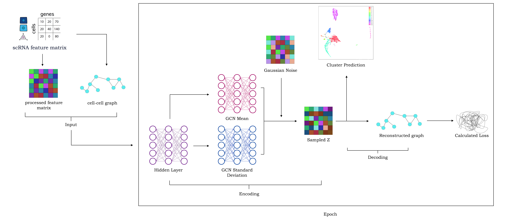

# A Gaussian mixture model-based variational graph autoencoder (GMM-VGAE) algorithm for clustering single-cell RNA-seq data
## Abstract
**Background:** Cell type identification from single-cell RNA sequencing (scRNA-seq) is crucial to understand disease mechanisms for disease diagnosis and drug discovery, which involves classifying the data into clusters of single cells. 
**Objectives:** scRNA-seq data is high dimensional with many analysis challenges. In this study, we propose to integrate advanced statistical modeling and deep learning and develop a Gaussian mixture model-based variational graph autoencoder (GMM-VGAE) to address this important issue.
**Methods:** GMM-VGAE is an unsupervised clustering algorithm that takes inputs of cell-cell graph and gene feature matrix to feed through the graph encoder and decoder to reconstruct the cell-cell graph. We applied the method and other three baseline models to cluster the single cells from three publicly available datasets.
**Results:** Using adjusted Rand index (ARI) as model performance measure, we showed the GMM-VGAE algorithm has better performance than other baseline models in all three datasets. With ARI of 0.940 for the Baron3 dataaset, 0.948 for Baron4 dataset, and 0.936 for Darmanis dataset.
**Conclusions:** Combination of statistical modeling and unsupervised deep learning algorithm can be successfully applied to analyze scRNA-seq data. By incorporating GMM-VGAE algorithm in scRNA sequencing, the performance of future analysis and application can be enhanced.

**Keywords**: single cell RNA-sequencing, gaussian mixture model-based variational graph autoencoder, unsupervised clustering, deep learning

