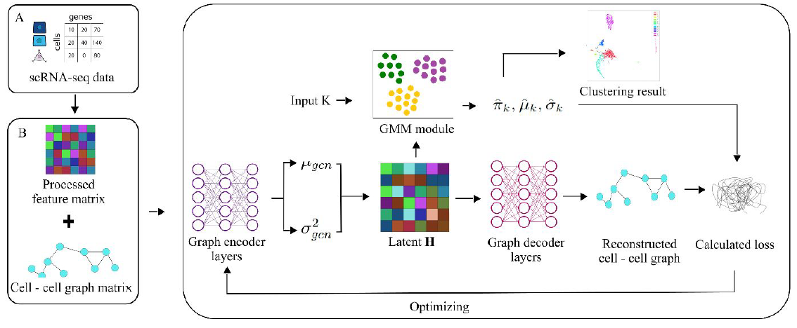

# A Gaussian mixture model-based variational graph autoencoder (GMM-VGAE) algorithm for clustering single-cell RNA-seq data
## Abstract

**Motivation**: Cell type identification using single-cell RNA sequencing (scRNA-seq) is critical for
understanding disease mechanisms for disease diagnosis and drug discovery, which involves
classifying data into clusters of single cells. Although significant deep learning approaches have been
presented and demonstrated to improve clustering performance in high dimensional scRNA-seq data
when compared to traditional scRNA-seq clustering methods, cell clustering analysis using an
extendable end-to-end framework integrating advanced statistical clustering with deep learning
approaches is still understudied.

**Results**: To address this issue, we proposed a Gaussian mixture model-based variational graph
autoencoder on scRNA-seq (scGMM-VGAE) which is a combination of an advanced statistical
method and a deep learning model. The unsupervised clustering algorithm scGMM-VGAE clusters
cell types by applying the GMM clustering module to latent data encoding by inputting cell-cell
graph and a gene feature matrix. We clustered single cells from four publicly available scRNA-seq
datasets and three simulated datasets using the proposed method and compared its performance with
four baseline models. By successfully incorporating a statistical model into an unsupervised deep
learning algorithm to cluster cell types in scRNA-seq data, the scGMM-VGAE algorithm
significantly outperformed the selected baseline models in both the real and simulated scRNA-seq
datasets using the adjusted Rand index (ARI), normalized mutual information (NMI), and Silhouette
coefficient (SC) as model performance measures.

**Keywords**: Algorithms, Clustering, Machine learning, Single Cell, Statistics, RNA-Seq

We acknowledge Mrabah et al. for their source code repository https://github.com/nairouz/R-GAE we used in the study.  

